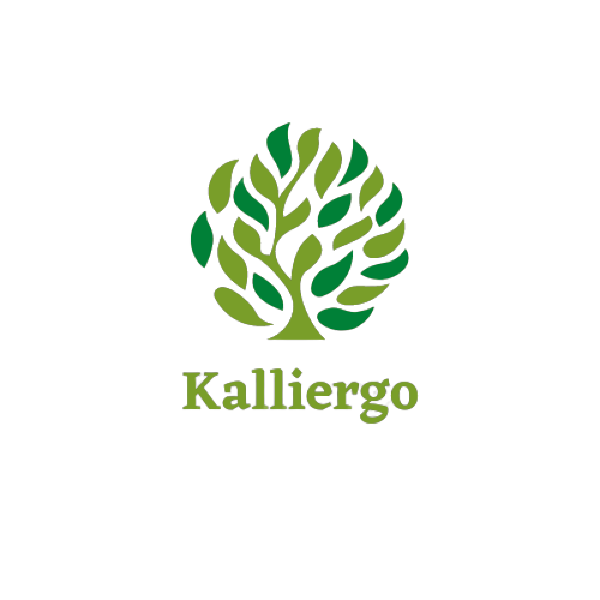
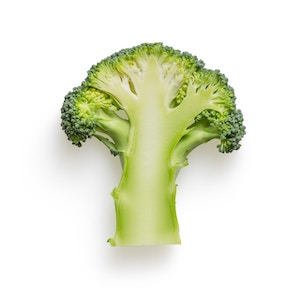
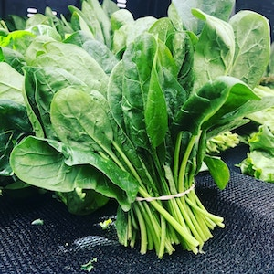
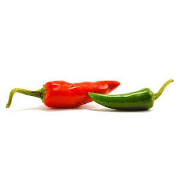
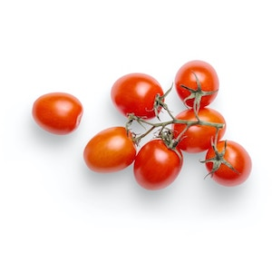

<!DOCTYPE html>
<html lang="en">
  <head>
    <meta charset="UTF-8" />
    <meta http-equiv="X-UA-Compatible" content="IE=edge" />
    <meta name="viewport" content="width=device-width, initial-scale=1.0" />
    <title>Kalliergo | Indonesia</title>
    <!-- font download google -->
    <link rel="preconnect" href="https://fonts.googleapis.com" />
    <link rel="preconnect" href="https://fonts.gstatic.com" crossorigin />
    <link
      href="https://fonts.googleapis.com/css2?family=Poppins:wght@100;300;400;500;600;700&display=swap"
      rel="stylesheet"
    />
    <!-- Feather Icons -->
    
    <link rel="stylesheet" href="csss/style.css" />
  </head>
  <body>
    <!-- navbar start-->
    <nav class="navbar">
      

        
      

      

        <a href="#home">Home</a>
        <a href="#about">About Us</a>
        <a href="#product">Our Product</a>
        <a href="#blog">Blog</a>
        <a href="#contact"> <button>Contact Us</button></a>
      

      

        <a href="#" id="search"><i data-feather="search"></i> </a>
        <a href="#" id="notifications"><i data-feather="bell"></i> </a>
        <a href="#" id="cart"><i data-feather="shopping-cart"></i> </a>
        <a href="#" id="menu"><i data-feather="menu"></i> </a>
      

    </nav>
    <!-- navbar end -->

    <!-- Hero section start -->
    <section class="hero" id="home">
      <main class="content">
        <h1>
          Grow  Easier  and  Healthier  With Our
           Hydroponics 
        </h1>
        

          "Discover the Future of Farming with Hydroponic: Efficient,
          Sustainable, and Bountiful! Enjoy fresh, nutrient-packed produce
          year-round without the hassle of soil or traditional farming.
          Revolutionize your gardening game with the power of hydroponic, and
          elevate your harvest to new heights!"
        

        <a href="#" class="cta"> Join Us! </a>
        <a href="#" class="ctb"> Know More </a>
      </main>
    </section>

    <!-- Hero section end -->

    <!-- about section start -->

    <section id="about" class="about">
      <h2>About Us</h2>

      

        

          
        

        

          <h3>Why must our Hydroponics ?</h3>
          

            Say goodbye to traditional farming methods and embrace the future of
            agriculture with our state-of-the-art hydroponic system! With our
            innovative technology, you can cultivate crops without soil, making
            it possible to grow fresh produce in any environment, all year
            round. Our hydroponic solution offers numerous benefits that are
            unparalleled in traditional farming, including higher yields, faster
            growth rates, and efficient use of resources such as water and
            fertilizers. Say hello to a sustainable and profitable farming
            future with our cutting-edge hydroponic system!
          

          

            Experience the advantages of hydroponic farming with our customized
            solution that is tailored to suit your specific needs. Whether
            you're a small-scale urban farmer or a large commercial grower, our
            hydroponic system can be easily scaled to accommodate your
            requirements. With precise control over nutrient levels, pH, and
            other environmental factors, our hydroponic system allows you to
            optimize plant growth and maximize your harvest. Say goodbye to the
            limitations of traditional farming and unlock the full potential of
            your crops with our advanced hydroponic solution, backed by years of
            research and proven results. Join the hydroponic revolution and
            elevate your farming game with our cutting-edge technology!
          

        

      

    </section>

    <!-- about section end -->

    <!-- product section start -->

    <section id="product" class="product">
      <h2>Our Product</h2>
      

        Dengan tagline "Kebun Modern Tanpa Tanah", produk hydroponik kami
        menjadi solusi inovatif untuk menghadapi tantangan pertanian masa depan
        yang mengutamakan efisiensi, kebersihan, dan keberlanjutan. Bergabunglah
        dengan revolusi pertanian modern dengan menggunakan produk hydroponik
        kami, dan nikmati hasil panen yang segar dan berkualitas tinggi
        sepanjang tahun. Mari bersama-sama menciptakan masa depan pertanian yang
        lebih cerdas, bersih, dan berkelanjutan dengan produk hydroponik kami!
      

      

        

          
          <h3 class="product-card-tittle">Fresh Cabbage</h3>
          
Rp 15.000/kg

        

        

          
          <h3 class="product-card-tittle">Fresh Spinach</h3>
          
Rp 45.000/kg

        

        

          
          <h3 class="product-card-tittle">Fresh Chili</h3>
          
Rp 50.000/kg

        

        

          
          <h3 class="product-card-tittle">Fresh tomato</h3>
          
Rp 7000/kg

        

        

          
          <h3 class="product-card-tittle">Fresh tomato</h3>
          
Rp 7000/kg

        

        

          
          <h3 class="product-card-tittle">Fresh tomato</h3>
          
Rp 7000/kg

        

      

    </section>

    <!-- product section end -->

    <!-- contact section start -->

    <section id="contact" class="contact">
      <h2>Our Contact</h2>
      

        Kami akan sangat senang jika Anda menghubungi kami menggunakan kolom
        kontak di atas. Tim kami akan dengan senang hati membantu Anda dalam
        menjawab pertanyaan atau memberikan bantuan yang Anda butuhkan.
      

      

        <iframe
          src="https://www.google.com/maps/embed?pb=!1m18!1m12!1m3!1d3989.666023355129!2d101.47314951473848!3d0.5006198996347632!2m3!1f0!2f0!3f0!3m2!1i1024!2i768!4f13.1!3m3!1m2!1s0x31d5ae8be8b858e9%3A0x4316923e5dbf2251!2sJl.%20Harapan%20Raya%20No.310%2C%20Tengkerang%20Labuai%2C%20Kec.%20Bukit%20Raya%2C%20Kota%20Pekanbaru%2C%20Riau%2028131!5e0!3m2!1sid!2sid!4v1681145035724!5m2!1sid!2sid"
          allowfullscreen=""
          loading="lazy"
          referrerpolicy="no-referrer-when-downgrade"
          class="map"
        ></iframe>

        <form action="">
          

            <i data-feather="user"></i>
            <input type="text" placeholder="nama" />
          

          

            <i data-feather="mail"></i>
            <input type="text" placeholder="email" />
          

          

            <i data-feather="phone"></i>
            <input type="text" placeholder="nomor hp" />
          

          <button type="submit" class="btn">Kirim Pesan</button>
        </form>
      

    </section>

    <!-- contact section end -->
<!--    cobaaa yaah  -->
    <!-- footer section start -->

    <footer>
      

        <a href="https://www.instagram.com/jepripnjtn/">
          <i data-feather="instagram"></i
        ></a>
        <a href="https://twitter.com/jefripnjtn"
          ><i data-feather="twitter"></i
        ></a>
        <a href="https://www.linkedin.com/in/jepri-b3185b253/">
          <i data-feather="linkedin"></i
        ></a>
      

      

        <a href="#home">Home</a>
        <a href="#about">Abous Us</a>
        <a href="#product">Our Product</a>
        <a href="#contact">Our Contact</a>
      

      

        

          Created by
          <a href="https://www.linkedin.com/in/jepri-b3185b253/">Jepri</a> |
          &copy;2023.
        

      

    </footer>
    <!-- footer section end -->

    <!-- feather Icons -->
    

    <!-- my java script -->
    
  </body>
</html>
